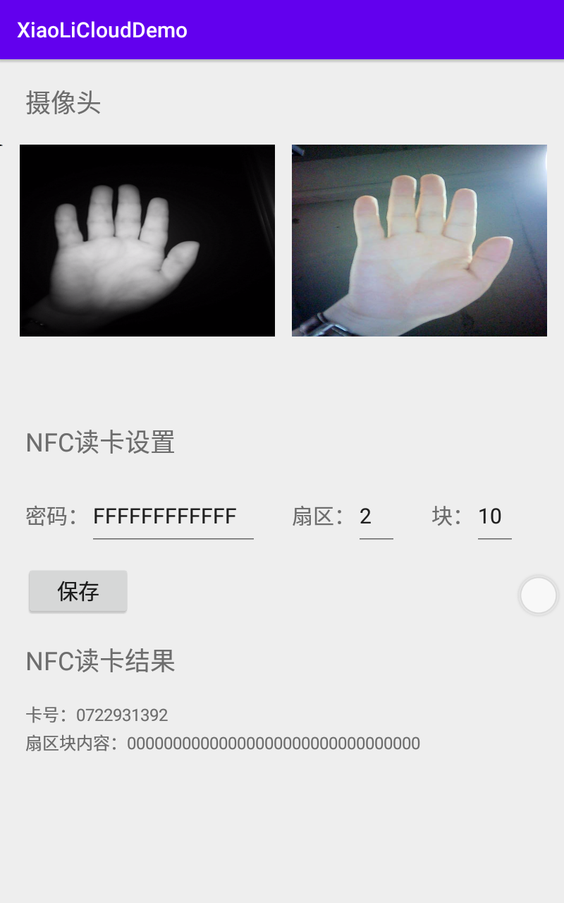

# XiaoLiCloudDemo
小厘云手环机硬件调用样例

## 样例功能
* 摄像头预览
* NFC 读卡（新旧兼容）

## 环境
* Android Studio 3.6.1
* gradle-5.6.4
* kotlin_version = '1.3.71'

> 如果版本低于以上只需配置降低版本即可

## 摄像头依赖
```gradle
implementation 'com.guo.android_extend:android-extend:1.0.6'
```

## APP 预览
可以安装主目录下的 `app-release.apk` 看效果


